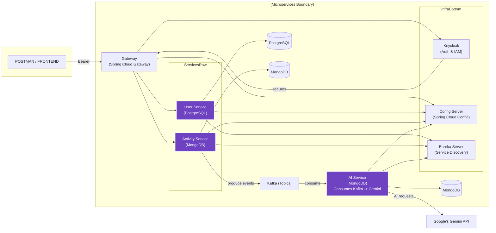

# 🏋️‍♂️ AI-Powered Fitness App — Microservices Architecture

  
  
  
  
  
  
  

---

## 📌 Table of Contents
- Overview  
- Architecture Summary  
- Tech Stack  
- AI Integration  
- Authentication & Security  
- Services & Responsibilities  
- Local Development Setup   
- How to Run (Recommended order)  
- Deployment Notes  
- Testing & Observability  
- Roadmap  
- Diagram  
- Contributing  

---

## 🚀 Overview
A production-ready **microservices fitness app** that collects user activity, processes events asynchronously with **Kafka**, and provides personalized fitness insights using **Google Gemini AI**.  
Built with **Spring Boot & Spring Cloud**, secured by **Keycloak**, and backed by **PostgreSQL** & **MongoDB**.

---

## 🔧 Architecture Summary
- **Gateway** → Routes requests via Spring Cloud Gateway; secures endpoints with Keycloak.  
- **User Service** → Manages user profiles & registration. Stores data in **PostgreSQL**.  
- **Activity Service** → Captures workout data, stores in **MongoDB**, and publishes events to **Kafka**.  
- **AI Service** → Consumes Kafka events, enriches data, and calls **Google Gemini API**. Persists AI insights in **MongoDB**.  
- **Infra Services**:  
  - **Kafka**: Messaging backbone  
  - **Config Server**: Centralized configuration  
  - **Eureka**: Service discovery  
  - **Keycloak**: Authentication & IAM  

---

## 🧩 Tech Stack
- **Backend** → Java, Spring Boot, Spring Cloud  
- **Databases** → PostgreSQL (User), MongoDB (Activity & AI)  
- **Eventing** → Apache Kafka  
- **Security** → Keycloak (OIDC/OAuth2)  
- **AI** → Google Gemini API  

---

## 🧠 AI Integration
- The **AI Service** consumes user activities from Kafka.  
- Sends structured activity data to **Google Gemini API**.  
- Stores AI-driven insights in MongoDB for personalized recommendations.  

---

## 🔐 Authentication & Security
- All endpoints secured by **Bearer <TOKEN>** via **Keycloak**.  
- Keycloak manages user roles, permissions, and OIDC flows.  

---

## 🗂 Services & Responsibilities

| Service          | Responsibility                           | Persistence |
|------------------|------------------------------------------|-------------|
| Gateway          | API routing & auth enforcement           | —           |
| User Service     | Registration, login, profile             | PostgreSQL  |
| Activity Service | Store activities, publish Kafka events   | MongoDB     |
| AI Service       | Consume Kafka, call Gemini, store insights | MongoDB   |
| Kafka            | Event streaming backbone                 | —           |
| Keycloak         | Authentication & Authorization           | —           |
| Config Server    | Centralized configuration                | —           |
| Eureka           | Service discovery & registration         | —           |

---

## 🛠 Local Development Setup
```bash
# clone repository
git clone https://github.com/your-org/fitness-app.git
cd fitness-app

# build services
mvn clean install

```

## ⚙️ How to run (Recommended order)

1. Start infrastructure components:

   * Start **Config Server**
   * Start **Eureka Server**
   * Start **Keycloak** (import realm and client configs)
2. Start messaging & databases:

   * Start **Zookeeper** and **Kafka**
   * Start **PostgreSQL** and **MongoDB**
3. Start microservices (use environment variables or config server):

   * User Service
   * Activity Service
   * AI Service
   * Gateway Service
4. Ensure services register with Eureka and pick up config from Config Server.
5. Use Postman or your frontend to call the Gateway endpoints with a Keycloak-issued token.

## ⚙️ Deployment notes

* Secure access to Keycloak and Config Server; use TLS in all environments.
* For Gemini integration, store API keys/secrets in a secure vault and inject via Config Server or environment variables.

## 🧪 Testing & Observability

* Unit & integration tests per-service (Spring Boot Test).
* Use Prometheus & Grafana for metrics; centralized logs with ELK / Loki.
* Configure Kafka consumer groups and monitor lag for AI Service.
  
## 📁 Diagram

---

## ✅ Current Status

* Backend microservices implemented and working locally.
* AI integration with Gemini wired via the AI Service.
* Frontend (React) is in progress.

## 🙏 Contributing

Contributions are welcome — please fork, open issues for bugs or feature requests, and submit PRs.

---

---
